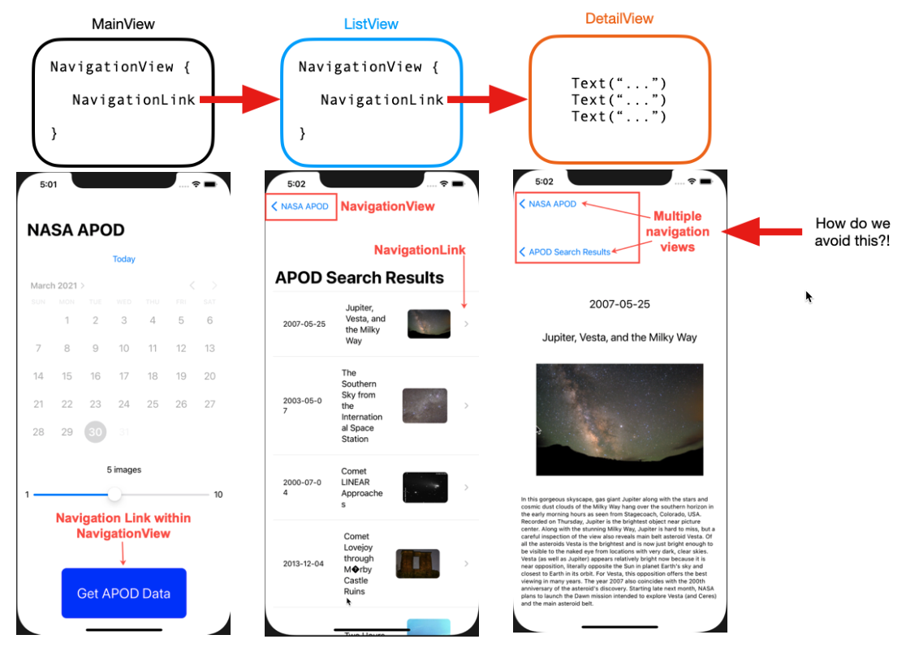
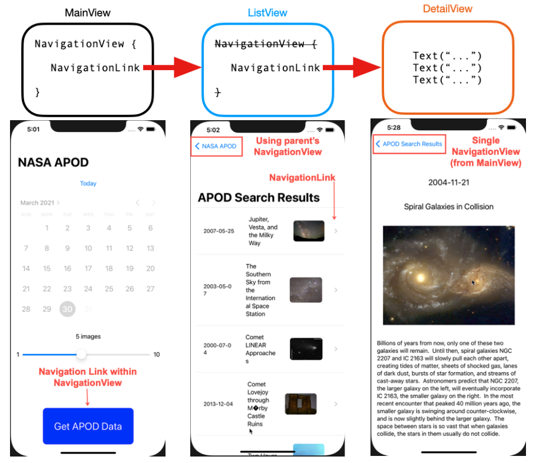

# SwiftUINavDemo
SwiftUI navigation demo

This app demonstrates the following:

- Navigation between multiple levels of views with a single `NavigationView` (avoiding multiple nav bars)
- Sharing data between views using `@State`, `@StateObject` and `@EnvironmentObject`

---

# Avoiding Multiple NavigationViews

Let's say you have three linked views:



The solution is simple: **remove** the `NavigationView` from child views (e.g. ListView in this example). 
This means that any `NavigationLink` in child view will use the parent's `NavigationView`:
 
 ```swift
 struct MainView: View {
    var body: some View {
        
        NavigationView {
            NavigationLink(destination: ListView()) {}
        }
    }
}

struct ListView: View {
    var body: some View {
        
        // Using parent's (MainView) NavigationView
        NavigationLink(destination: DetailView()) {}
    }
}

struct DetailView: View {
    var body: some View {
        
        // Using MainView's NavigationView
        Text("...")
        Text("...")
        Text("...")
    }
}
 ```
 
 If you use this approach then any `NavigationLink` in a child view will automatically use its parent's `NavigationView`:
 
 
 
 ## The navigationViewStyle Modifier
Note that the `.navigationViewStyle(StackNavigationViewStyle())` modifier fixes the following non-fatal runtime error:

```
displayModeButtonItem is internally managed and not exposed for DoubleColumn style.
Returning an empty, disconnected UIBarButtonItem to fulfill the non-null contract.
```

We see this error when navigating from a child view to another child view unless the `StackNavigationViewStyle` is used.

Example:

```swift
struct ContentView: View {
    var body: some View {

        NavigationView {
            
            NavigationLink(destination: View2()) {
                Text("Goto View2")
            }
        }
        
        // Using the .navigationViewStyle(StackNavigationViewStyle()) modifier fixes the following
        // non-fatal runtime error:
        //
        //      displayModeButtonItem is internally managed and not exposed for DoubleColumn style.
        //      Returning an empty, disconnected UIBarButtonItem to fulfill the non-null contract.
        //
        // We see this error when navigating from View2 to View3 unless the StackNavigationViewStyle
        // is used.
        .navigationViewStyle(StackNavigationViewStyle())
    }
}
```

# Sharing data between views

There are various strategies for sharing data across views:

- **Parent to Child**
    - Direct `injection` of property into the child's initializer
    - Create `@State` object in the parent, `@Binding` in the child
    - Parent creates shared data model

- **Parent to non-direct Child**
    - Parent creates shared data model

- **Child to Parent**
    - `Closure` (one-way from child to parent)
    - Child updates `@Binding`
    - Parent creates shared data model

- **Child to non-direct Parent**
    - `PreferenceKey` key-value pair
    - Parent creates shared data model

In this app we share data between parent and child views using `@State` and `@Binding`.
We also have a shared model of type `WidgetFactory<Widget>` which is created at the `App` level:

```swift
import SwiftUI

@main
struct SwiftUINavDemoApp: App {
    
    // Create shared model
    @StateObject var widgetFactory = WidgetFactory<Widget>()
    
    var body: some Scene {
        WindowGroup {
            WidgetCreationView()
                .environmentObject(widgetFactory)  // Make available to all views
        }
    }
}

struct FactoryView: View {
    
    @EnvironmentObject var widgetFactory: WidgetFactory<Widget>  // Access the shared model
    
    var body: some View {
        
        List(widgetFactory.inventory) { widget in
            WidgetView(fillColor: Binding.constant(widget.color),
                       lineColor: Binding.constant(widget.lineColor),
                       lineWidth: Binding.constant(Double(widget.lineWidth)),
                       price: Binding.constant(widget.price))
        }
    }
}
```
